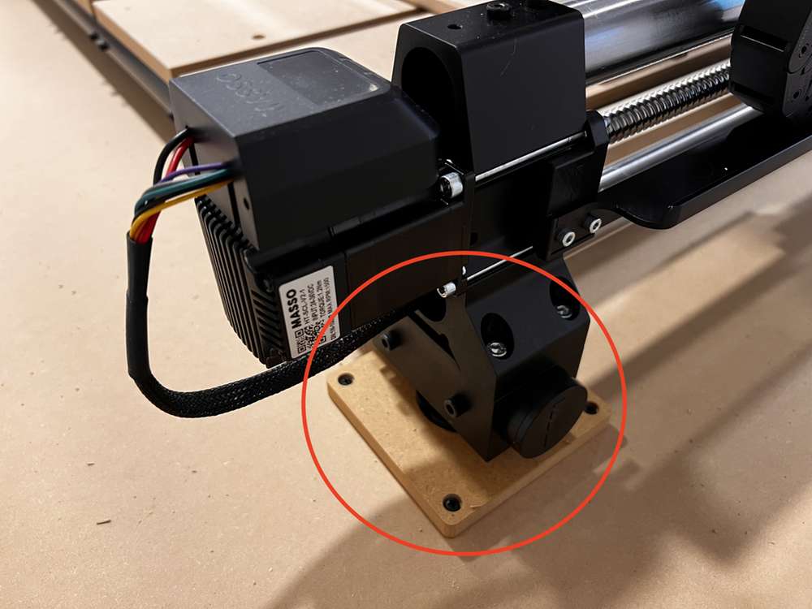
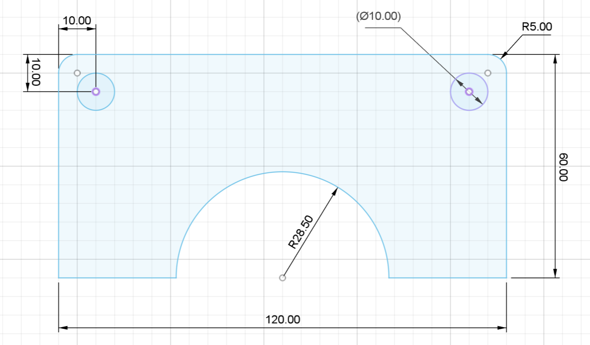

# OneFinity QCW Retainer Blocks

Retainer blocks to secure the OneFinity Elite QCW to a table. The frame combined with the OneFinity is rock solid, but the blocks provide extra protection to keep the machine from "walking" across the table. Blocks are split in half allowing them to be installed once the machine is setup.

Finished pieces can also be purchased from the [Highline Woodworking Etsy Site](https://www.etsy.com/shop/HighlineWoodworking)

## Notes

* drawing units are mm
* 300 x 340mm blank
* 12.7mm (1/2 inch) MDF
* simple machining with 1/4 inch end mill
* (16) x #8 1 inch coarse pan head screws to secure blocks to a work surface
* [Amazon Link for Screws](https://www.amazon.com/gp/product/B01M63E8DR/ref=ppx_yo_dt_b_search_asin_title?ie=UTF8&psc=1)
* inset fastening holes 3mm

## Files

* qcw_retainer_blocks_v01.art = [Carveco Maker](https://carveco.com/carveco-software-range/carveco-maker/) source file
* qcw_retainer_blocks_v01.dxf = [DXF](https://en.wikipedia.org/wiki/AutoCAD_DXF) source file 

## Versions

* v01 | 9-Feb-2025 | inital post

