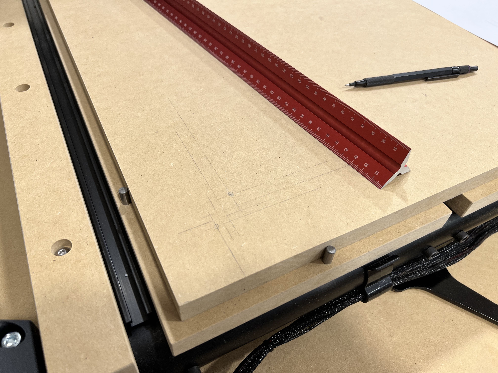

# Outer Alignment Holes

* Precisely aligns left and bottom edge of spoilboard on the QCW frame
* Peck holes using a 1/4 inch up-cut end mill, for example:
  * [Woodpeckers US2100U](https://www.woodpeck.com/ultra-shear-2-flute-quarter-inch-solid-carbide-spiral-bits.html)
* Holes are aligned so board is positioned 10mm in from lower-left edge of leftmost large QCW slat
* For 1/4 inch bit, hole center is 6.825mm from edges
* Two holes on each side, at 110mm and 1080mm on X and 110mm and 700mm on Y
* Alignment pins are more accurate and reliable than using a line and manually positioning the spoilboard
* Since the holes are CNC routed the spoilboard will be precisely aligned with the CNC X and Y axes

Spoilboard aligned with 1/4 inch alignment pins 10mm in from the lower-left corner of the leftmost wide QCW slat.
